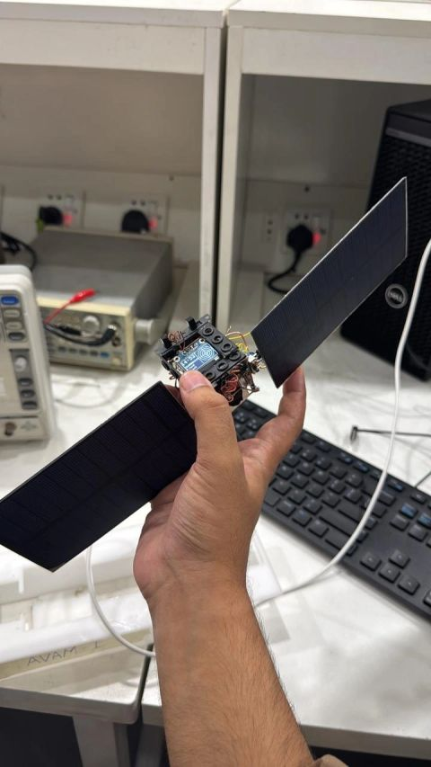

# ENA Nano Satellite

An ESP32-C3 based autonomous nano satellite prototype designed for environmental telemetry, low-power embedded systems, and electric network analysis.

## Features

- ESP32-C3 Super Mini
- OLED dashboard
- SHT31 temperature & humidity
- LiPo battery powered
- Solar charging
- WiFi NTP synchronization
- Deep sleep power management
- Real-time telemetry display

## Hardware

- ESP32-C3 Super Mini
- SSD1306 OLED
- SHT31
- TP4056 Charger
- 3.7V LiPo
- Dual 6V Solar Panels

## Software

- Arduino Framework
- C++
- ESP-IDF libraries
- I2C
- WiFi
- NTP

## Images
## Prototype Images

### Complete Prototype

### Front View

### Top View

## Future Work

- MQTT telemetry
- LoRa communication
- SD card logging
- Cloud dashboard
